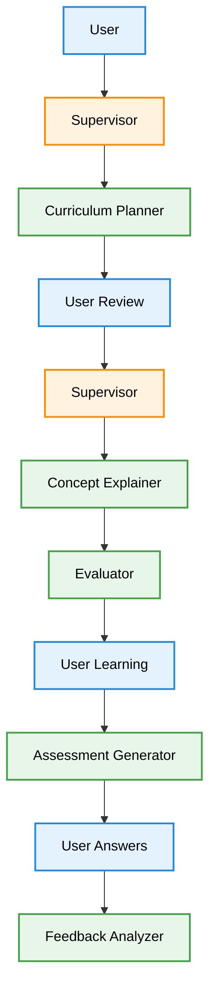

# Multi-Agent Personalized Education Tutor

## 1. Chosen Use Case & Rationale

This project implements a **multi-agent adaptive tutoring system for any course or concept**.  
The system personalizes learning by coordinating multiple specialized agents such as curriculum planning, concept explanation, assessment generation, and feedback analysis.

The multi-agent architecture was chosen to simulate a real tutoring team where each agent focuses on a specific educational task, improving learning quality and adaptability.

---

## 2. Agent Team Design

### 2.1. Agents and Roles

- **Supervisor Agent**  
  Coordinates all tutoring agents, decides which agent should act next, and determines when to request human approval.

- **Curriculum Planner Agent**  
  Creates a structured learning roadmap by dividing the course of interest into modules and submodules.

- **Concept Explainer Agent**  
  Explains concepts in simple and understandable language.

- **Assessment Generator Agent**  
  Generates multiple-choice questions (MCQs) based on covered topics and provides interactive options for students.

- **Evaluator Agent**  
  Reviews outputs of other agents to improve clarity and reduce hallucinations.

- **Feedback Analyzer Agent**  
  Analyzes student answers and provides corrective feedback.

- **Progress Tracker & Report Generator Agent**  
  Tracks student progress and generates learning reports and performance summaries.

---

### 2.2. Communication Flow Diagram

**3. Key Challenges & Solutions**
- **Coordination**: Multiple agents required proper sequencing.
 **Solution**: Implemented a Supervisor agent to control execution order.
  
- **Hallucinations**: Agents sometimes generated incorrect facts.
**Solution**: Added an Evaluator agent to verify outputs.

- **Cost**:Multiple API calls increased cost.
**Solution**: Reduced token limits and optimized prompts.

## 4. Reflection Report

The multi-agent approach provided several advantages over a single-agent system. By assigning specialized roles to different agents, the system was able to break down complex tasks into manageable subtasks, improving response quality and structure. The planner agent helped coordinate tasks, while the research and writer agents focused on accuracy and clarity, respectively. This modular design made the system more scalable and easier to debug.

Compared to a single agent, the multi-agent system reduced hallucinations and improved task organization. However, it introduced challenges such as increased API costs and coordination complexity. These issues were mitigated by limiting agent steps and optimizing prompts. Overall, the multi-agent architecture demonstrated better collaboration, reliability, and extensibility for complex AI tasks.

# How to Run the Multi-Agent Tutor App 
## Application Entry Files

- `index.html` – Loads the React application in the browser.
- `index.tsx` – Main entry point that renders the React app.
- `App.tsx` – Main application logic and multi-agent coordinator UI.

## Core Multi-Agent Components

- `components/AgentTerminal.tsx` – Displays agent conversations.
- `components/CurriculumView.tsx` – Shows curriculum plan.
- `components/LessonView.tsx` – Displays concept explanations.
- `components/QuizView.tsx` – Generates and shows assessments.
- `components/ProgressReport.tsx` – Tracks learning progress.

## AI Agent Communication Layer

- `services/geminiService.ts` – Handles communication with Gemini LLM API.
- `types.ts` – Defines agent roles and message types.

## Requirements
- Node.js (version 18 or higher)
- Internet connection
- A Gemini API Key (free from Google AI Studio)

## Steps to Run the Application

1. Download the repository:
   Click **Code → Download ZIP**  
   OR run:
   git clone <your-repo-link>

2. Open the folder in VS Code.

3. Install dependencies:
   npm install

4. Set the `GEMINI_API_KEY` in [.env.local](.env.local) to your Gemini API key

5. Start the application:
   npm run dev

6. Open this link in a browser:
   http://localhost:5173

The multi-agent tutor interface will appear in the browser.

## Run Locally
View your app in AI Studio: https://ai.studio/apps/drive/1YmXIyQI66wa6iiVYaOWEzopSI340gWnj
**Prerequisites:**  Node.js
## Demo Scenario

### Example User Query
"Teach me Python loops and give me a quiz."

### Agent Collaboration Flow
1. Supervisor assigns task to Curriculum Planner.
2. Curriculum Planner creates learning roadmap.
3. Concept Explainer teaches loops with examples.
4. Evaluator checks explanation quality.
5. Assessment Generator creates quiz questions.
6. Feedback Analyzer evaluates student answers.

### Screenshots
(Add screenshots of your running app here)
